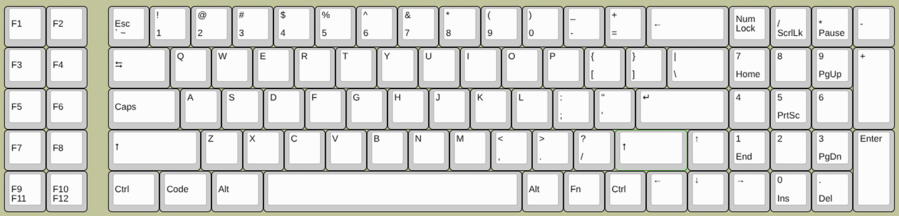
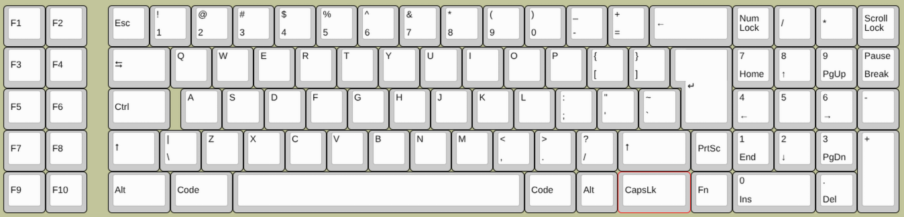
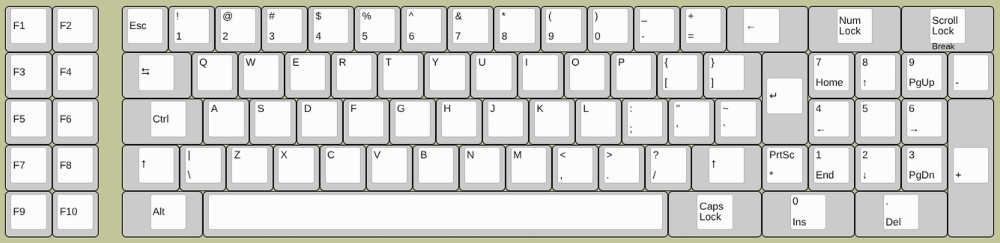

A drop-in replacement mechanical keyboard for the Compaq Portable I/Plus foam and foil keyboard

## Specifications

- Controller: RP2040
- Switches: MX Cherry/Gateron Brown
- Keycaps: [Carbon PBT Double Shot Retro Orange](https://www.amazon.com/dp/B0D14Z76RH)
- Plate: FR4
- PCB: FR4, 2 layer, Hot-swappable
- Backlit

## Layout

### Modern

### Compatible

### Original

## Pipe Dreams:
- Plates of other materials
- Acoustic foam
